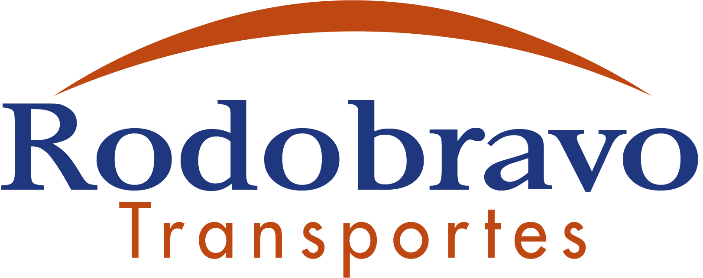

<h1 align="center"></h1>

## No que consite o projeto ?

A Rodobravo Transportes passando por um processo de reformulação de seus negócios precisava de uma nova apresentação ao mercado e seus clientes. Este projeto trouxe todo um embasamento visual focado na identidade do cliente e no que há de novo no mundo do desenvolvimento web para proporcionar a melhor experiência possível aos usuários, tornando assim a comunicação da empresa clara e assertiva com seus clientes.

## Ambientes

- [✓] Front: React
- [✓] Back: Node Js

#### :)
- Não esqueça de seguir a empresa no insta [@rodobravo_transportes](https://www.instagram.com/rodobravo_transportes/) :heart:
- E acesse o site para ver o resultado [Rodobravo](https://rodobravotransportes.com.br) 

<h1>License</h1>

GNU GENERAL PUBLIC LICENSE

Copyright (c) 2019 | Desenvolvido por Rian Tavares & Gabriel Soares

