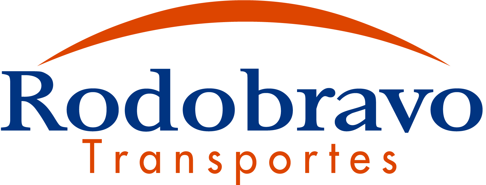

## What's this project? 
The Rodobravo Transportes is a transport company that was passing through a business reformulation and trusted me to build a entire new presentation to the market and their clients.

This project was thought and designed carefully to enable a better experience for users, making more assertive and clear the company message. I used some UX concepts and built a layout that was used as a guide for coding and you can see better on this document.

## Techs

- [✓] ReactJS (front-end)
- [✓] NodeJS (back-end)

## Design
We started our design project thinking only on mobile template, following the concept of mobile first making our project entire built for a good user experience using a mobile.

Clicking [HERE](https://xd.adobe.com/spec/71c69104-f286-434a-76b7-3fddb211b752-07f7/screen/c5c2e913-35f4-44c2-8317-2ea8faf9433d/Inicio-1/) you can see all the pages built using Adobe XD

## Live
 ~~The project is currently running on production enviroment and you can access here https://www.rodobravotransportes.com.br~~

 __UPDATE__: This project is no longer available at the main domain because the company is now part of another bigger company and is using another portal built by someone else.

With the purpose to share what was built by me and used by Rodobravo as the main portal from 2018 to 2020, I deployed the application at another domain. You can access clicking here: [https://staging-rodobravo-web.herokuapp.com/](https://staging-rodobravo-web.herokuapp.com/)

## Instagram
As part of the work to make more assertive and clear the company message to the clients and the market I also created an account on instagram where I planned posts, promotions and stories to interacte whit community and clients.
You can see clicking [Here](https://www.instagram.com/rodobravotransportes/)

#### :)
- if you enjoyed about this project add a star :star: 
- Don't forget to follow me on Instagram [@riantavareson](https://www.instagram.com/riantavareson/) :heart:
- And follow me also here on [github](https://github.com/RianTavares) :)

